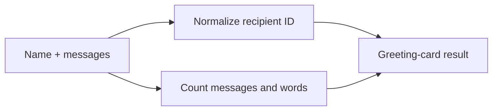

# Greeting Card Starter

This deliberately small first Component turns a person's name and a message list into a
stable greeting card. It is easy to fork into an onboarding message, notification
summary, contributor welcome, or profile-card service while still exercising input
normalization, aggregation, generated tests, compilation, and host execution.

## Application contract

| Concern | Decision |
| --- | --- |
| Application ID | `hello-component` |
| Kind | `greeting-summary` |
| Entrypoint | `run` |
| Recipient identifier | Unicode alphanumeric text normalized to kebab case (`unicode-alphanumeric-kebab`) |
| Reported metrics | `message_count` and `word_count` |

### Public invocation contract

`run` accepts exactly one positional argument. That argument is a JSON object with
exactly these fields:

| Field | Type | Meaning |
| --- | --- | --- |
| `name` | string | The recipient name. |
| `messages` | array of strings | The messages included in the greeting card. |

The callable surface MUST preserve that one-object boundary in every language. In
Python, for example, the public callable is `main(request)`, not
`main(name, messages)`. The process entrypoint receives the complete JSON argument
array in one command-line token, so its value is `[request]`.

`recipient_id` uses `unicode-alphanumeric-kebab` normalization: Unicode-casefold the
name, retain each Unicode alphanumeric character, replace each maximal run of all
other characters with one ASCII hyphen, and remove leading or trailing hyphens.

`word_count` is the sum, across every message, of its nonempty words. A word is a
maximal sequence of non-whitespace Unicode characters; one or more Unicode whitespace
characters separate words. An empty message therefore contributes zero words.

The result is one JSON object with exactly these fields and no others:

| Field | Type | Meaning |
| --- | --- | --- |
| `greeting` | string | `Hello, ` followed by the original `name` and `!`. |
| `recipient_id` | string | The normalized identifier defined above. |
| `message_count` | integer | The number of elements in `messages`. |
| `word_count` | integer | The total word count defined above. |

### Requirement: Deterministic hello lifecycle

The Component SHALL complete its offline workflow and reuse exact completed stages after
restart.

#### Scenario: Clean lifecycle

- **WHEN** the sample starts with deterministic inputs
- **THEN** every lifecycle stage completes and is reused on resume

### Requirement: Executable host outcome

The generated greeting-card application SHALL normalize a recipient, count supplied
messages and words, and create a portable recipient identifier.

#### Scenario: Compiled entrypoint runs

- **WHEN** the compiled `run` entrypoint receives one object containing the name Ada Lovelace and two messages containing six words
- **THEN** it returns the greeting `Hello, Ada Lovelace!`, recipient `ada-lovelace`, two messages, and six words
