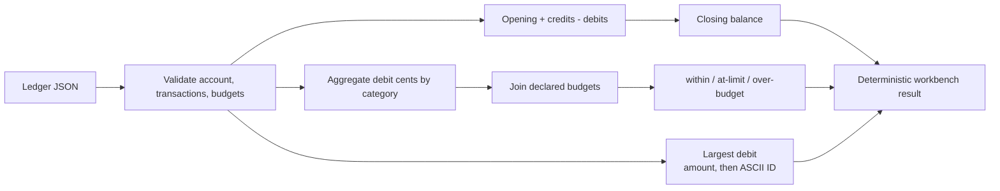

# JavaScript Ledger Workbench

One validated ledger feeds two calculations that are joined in the final workbench:
account reconciliation and category-budget analysis. Both use integer cents so the
same specification has identical meaning on every supported host. It is a useful seed
for personal finance, expense controls, project budgets, and offline-first bookkeeping.

## Application contract

| Concern | Decision |
| --- | --- |
| Application ID | `javascript-ledger-workbench` |
| Kind | `ledger-workbench` |
| Entrypoint | `run` |
| Amount storage | Integer cents (`integer-cents`) |
| Category ordering | ASCII ascending (`ascii-ascending`) |
| Largest-debit tie break | ASCII transaction ID ascending (`ascii-transaction-id-ascending`) |
| Output fields | Exact names and complete shape declared below |
| Runtime dependencies | Node.js built-ins only (`node-built-ins-only`) |

### Requirement: Validate an offline account ledger

The application SHALL accept one object containing `account_id`,
`opening_balance_cents`, `transactions`, and `category_budgets`. Monetary values SHALL
be signed-safe integers expressed in cents. Every transaction SHALL have a unique
non-empty ASCII `id`, a `kind` of `credit` or `debit`, a positive `amount_cents`, and a
non-empty ASCII `category`. Every budget SHALL have a unique category and a
non-negative integer `limit_cents`. Inputs SHALL contain at most 512 transactions and
128 budgets. Invalid input SHALL fail with a non-zero status and no result on standard
output.

#### Scenario: Valid ledger is accepted

- **WHEN** a ledger contains unique transactions and budgets within the declared limits
- **THEN** every amount is processed once without floating-point arithmetic

### Requirement: Reconcile balances and category budgets

The application SHALL add credits and subtract debits from the opening balance. Its
complete result object SHALL contain exactly `account_id`, `credit_cents`,
`debit_cents`, `closing_balance_cents`, `transaction_count`, `category_spend`,
`largest_debit_id`, and `over_budget_categories`; it SHALL NOT rename the credit or
debit fields to `total_credit_cents` or `total_debit_cents`. Debit amounts SHALL be
aggregated by category. Every declared budget SHALL appear in `category_spend` ordered
by ASCII category name with exactly `category`, `spent_cents`, `limit_cents`,
`remaining_cents`, and `status`. Its status SHALL be `over-budget` when spent exceeds
the limit, `at-limit` when equal, and `within-budget` otherwise. Categories used by a
debit but absent from the budget list SHALL make the input invalid.

#### Scenario: Budget is exceeded

- **WHEN** debit transactions in a category total more than its limit
- **THEN** remaining cents is negative, status is `over-budget`, and the category appears in `over_budget_categories`

### Requirement: Identify the largest debit deterministically

The application SHALL report the ID of the debit with the greatest amount. Equal
amounts SHALL be resolved by ASCII transaction ID ascending. The
`over_budget_categories` array SHALL also use ASCII ascending order. When there is no
debit, `largest_debit_id` SHALL be JSON `null`.

#### Scenario: Equal largest debit amounts

- **WHEN** two debits share the greatest amount
- **THEN** `largest_debit_id` is the ASCII-smallest of their IDs

### Requirement: Executable host outcome

The application SHALL perform the complete ledger reconciliation and budget analysis,
not return fixture-specific constants.

#### Scenario: Checked entrypoint runs

- **WHEN** the selected host implementation runs a valid declared invocation
- **THEN** the emitted JSON exactly matches the ledger result shape and values defined by this specification
