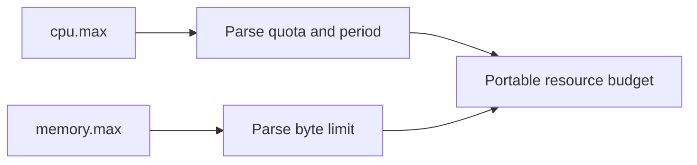

# Linux Cgroup Budget Interpreter

This Linux-only Component converts the raw values exposed by cgroup v2 into the CPU and
memory budgets an application scheduler actually needs. It is useful in container
launchers, observability agents, and admission controllers, while remaining deterministic
enough to test without depending on the worker's current container limits.

## Application contract

The `run` entrypoint accepts exactly one object with string fields `mount`, `cpu_max`,
and `memory_max`. `cpu_max` is either `max PERIOD` or `QUOTA PERIOD`, using positive
base-10 integers. `memory_max` is either `max` or one nonnegative base-10 integer.

The result contains exactly `mount`, `cpu_quota_millicores`, `memory_limit_bytes`, and
`constrained`. Trim leading and trailing ASCII whitespace from `mount`. Report `-1` for
an unlimited CPU or memory value. Otherwise compute CPU millicores as
`floor(QUOTA * 1000 / PERIOD)`. `constrained` is true when either resource is limited.

### Requirement: Interpret a cgroup v2 resource budget

The application SHALL parse Linux cgroup v2 CPU and memory limits into a deterministic
resource budget without reading undeclared host state.

#### Scenario: The compiled Linux entrypoint runs

- **WHEN** cgroup v2 quota and memory strings are supplied
- **THEN** the application returns exact millicore and byte limits with unlimited values represented by `-1`
