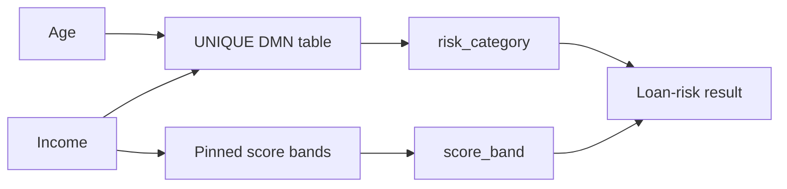

# Loan Risk Gate

This Component classifies a personal-loan applicant from two numbers: age in whole
years and annual income in whole currency units. Underwriters, origination desks, and
credit-policy sandboxes can fork it when they need a small, reviewable UNIQUE decision
table rather than prose scenarios. The closed risk intervals live in DMN, the named
income bands live in the pinned JSON asset, and the portable call/result boundary lives
in `interfaces/loan-risk-gate.md`.

The generated application exposes the `sample.portable-app` capability. Its exact
input, output, failure, DMN-result, and pinned score-band obligations are owned by the
public interface rather than duplicated in this descriptive authoring body.
