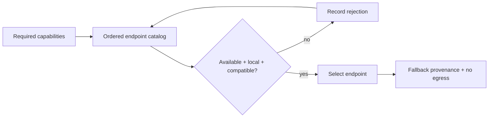

# Private AI Endpoint Router

The router is a privacy-preserving building block for applications that can use several
local AI endpoints. It evaluates candidates in declared policy order, selects the first
available capability match, and records enough provenance to explain fallback without
allowing request data to leave the local boundary.

## Application contract

| Concern | Decision |
| --- | --- |
| Application ID | `model-routing` |
| Kind | `model-router` |
| Entrypoint | `run` |
| Required locality | Local |
| Data egress | None |
| Selection policy | First compatible endpoint in declared order (`first-compatible`) |

### Input payload

The `run` entrypoint accepts one object with exactly these routing concepts:

| Field | Meaning |
| --- | --- |
| `required_capabilities` | An array of capability-name strings required by this request. |
| `endpoints` | An ordered array of endpoint records. |
| `endpoints[].id` | The endpoint identifier copied into `selected`, `considered`, and `rejected`. |
| `endpoints[].available` | A boolean; only `true` is available. |
| `endpoints[].locality` | A string; exactly `local` is local. Every other value is non-local. |
| `endpoints[].capabilities` | An array of capability-name strings provided by the endpoint. |

Capability compatibility is set containment: an endpoint is compatible when every
string in `required_capabilities` occurs in its `capabilities` array, regardless of
array order or additional capabilities. Implementations SHALL read the declared
`locality` field and SHALL NOT invent boolean `local` or `is_local` aliases.

### Requirement: Request-scoped offline fallback

The router SHALL deterministically select a compatible local fallback without
permitting source or request-data egress.

#### Scenario: Preferred endpoint unavailable

- **WHEN** the first local endpoint is unavailable
- **THEN** the next compatible endpoint is selected with fallback provenance and no egress

### Requirement: Executable host outcome

The generated routing application SHALL examine endpoints in declared order and stop
immediately after selecting the first available local endpoint that provides every
request capability. `considered` SHALL be exactly the evaluated prefix ending with the
selected endpoint; it SHALL NOT contain endpoints after the selection. `rejected` SHALL
contain, in order, every considered endpoint before the selection that failed
availability, locality, or capability compatibility. `fallback_used` SHALL be true if
and only if at least one endpoint was rejected before the selection.

Every successful result SHALL be one object containing every one of these five fields:
`selected` (string), `considered` (ordered string array), `rejected` (ordered string
array), `fallback_used` (boolean), and `data_egress` (the string literal `none`). No
successful result may omit the constant `data_egress` policy outcome; generated native
tests SHALL assert the complete five-field result rather than a reduced routing-only
projection.

#### Scenario: Compiled entrypoint runs

- **WHEN** the preferred code endpoint is unavailable and a compatible local fallback follows it
- **THEN** the compiled `run` entrypoint selects the fallback, records both candidates, and reports no data egress
