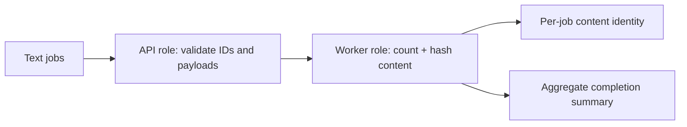

# Multi-Role Text Job Pipeline

This pipeline keeps request validation and worker processing in separately generated
source roles, then composes them behind one runnable entrypoint. The shape is a useful
starting point for ingestion services, queue workers, document processors, and other
systems whose public API and asynchronous work evolve independently.

## Application contract

| Concern | Decision |
| --- | --- |
| Application ID | `multi-repository-component` |
| Kind | `text-jobs` |
| Entrypoint | `run` |
| Generated members | `api`, `worker` |
| Digest | SHA-256 (`sha256`), first 12 lowercase hexadecimal characters |
| Text encoding | UTF-8 |

### Requirement: Aggregate identity

The aggregate SHALL retain exact member identities and remain independent of declaration
order.

#### Scenario: Two repository aggregate

- **WHEN** API and worker source snapshots are mounted in either input order
- **THEN** the aggregate identity and mounted-member set are identical

### Requirement: Executable host outcome

The generated job application SHALL compose API validation and worker processing from
separate source roots and return deterministic UTF-8 content identities. Every selected
job digest SHALL be the first 12 lowercase hexadecimal characters of SHA-256 with no
algorithm prefix. Every selected language Flavor SHALL generate non-empty `source/api/`
and `source/worker/` trees. The `run` entrypoint SHALL call validation implemented under
`source/api/` and processing implemented under `source/worker/`; it SHALL NOT inline
either member into the entrypoint.

#### Scenario: Compiled entrypoint runs

- **WHEN** the compiled `run` entrypoint receives two uniquely identified text jobs
- **THEN** it uses both generated member roots to validate the jobs, compute their word counts and SHA-256 prefixes, and report both as completed
