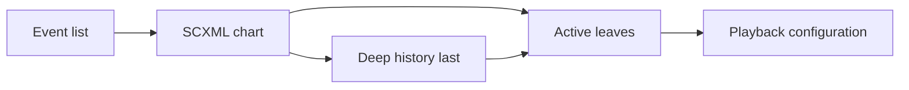

# Playback Controller

This Component is a small media-transport controller: play, mute, power, and resume
with deep history across two parallel regions. Device firmware, embedded players, and
session restorers can fork it when the product behavior is a state chart rather than a
decision table or a prose scenario list. The chart and replay traces own state-machine
behavior; `interfaces/playback-controller.md` owns the portable call/result boundary.

The generated application exposes the `sample.portable-app` capability. Its exact
input, output, ordering, and state-replay obligations are owned by the public interface
rather than duplicated in this descriptive authoring body.
