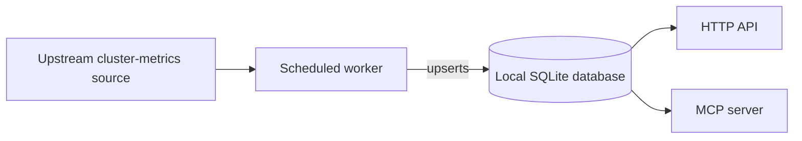

# Cluster Health Service

A small, representative instance of the `python-service-application` skill: one process,
one local SQLite database, and three cooperating entrypoints (HTTP API, embedded MCP
server, scheduled worker) that never call the upstream cluster-metrics source directly
from a request path. Only the scheduled worker talks to the upstream source; the HTTP API
and MCP server answer exclusively from the local database.

## Application contract

| Concern | Decision |
| --- | --- |
| Application ID | `cluster-health-service` |
| Kind | `persistent-service` |
| Entrypoint | `service` |
| Local store | Embedded SQLite, worker is the only writer |
| Upstream access | Scheduled worker only; API and MCP server are read-only against the local store |

### Requirement: Sample-host JSON probe

`portable-application-implementation` still owns the sample-host invocation: the
generated `service` artifact SHALL accept exactly one command-line argument, a UTF-8
JSON array, and SHALL spread that array as positional arguments. The independent
verifier's single array element is an object with exactly these fields:

| Field | Type | Meaning |
| --- | --- | --- |
| `clusters` | array of `{cluster_id, health}` | Seed the local store in this order before probing |
| `page_size` | integer | First-page bound for `GET /clusters` |
| `unknown_cluster_id` | string | Cluster ID used for the typed-404 probe |

Stdout SHALL be one JSON object with exactly these fields and no others:

| Field | Type | Meaning |
| --- | --- | --- |
| `item_count` | integer | `min(page_size, number of seeded clusters)` |
| `has_more` | boolean | `true` iff more seeded clusters exist after that first page |
| `next_cursor` | string or null | When `has_more`, the `cluster_id` of the last cluster on the first page (exclusive start of the next page). When not `has_more`, `null`. |
| `unknown_cluster_status` | integer | HTTP status of `GET /clusters/{unknown_cluster_id}`: `404` when that ID is absent from the seeded store |

This probe SHALL seed, page, and 404 through the real HTTP API and local store, not
by returning constants. It does not replace the long-running HTTP/MCP/worker
entrypoints; it is the sample-host acceptance surface.

#### Scenario: First page of three clusters is two items

- **WHEN** the probe argument seeds `alpha`, `beta`, `gamma` in that order, `page_size`
  is 2, and `unknown_cluster_id` is `missing`
- **THEN** the result is `item_count` 2, `has_more` true, `next_cursor` `"beta"`, and
  `unknown_cluster_status` 404

### Requirement: HTTP API surface

The Component SHALL expose an HTTP API with at least one collection endpoint,
`GET /clusters`, returning cursor-paginated results (`next_cursor`, `has_more`) and at
least one resource endpoint, `GET /clusters/{cluster_id}`, returning a typed response
model with an explicit status code, using dependency injection for the database session
rather than constructing it inline in the handler. A request for a cluster ID that does
not exist SHALL return a typed 404, never a bare 500.

#### Scenario: Listing clusters is paginated

- **WHEN** the local database holds more clusters than one page
- **THEN** `GET /clusters` returns a bounded page plus `has_more: true` and a
  `next_cursor` equal to the last `cluster_id` on that page; a subsequent listing that
  starts after that cursor returns the remaining clusters in the same order

#### Scenario: Unknown cluster is a typed 404

- **WHEN** `GET /clusters/{cluster_id}` is called with an ID absent from the local database
- **THEN** the API returns HTTP 404 with a structured error body, not an unhandled
  exception

### Requirement: Embedded MCP server

The Component SHALL expose an MCP server, as a separate entrypoint from the HTTP API but
sharing the same read-only database access layer, with at least one tool
(`get_cluster_health`, taking a `cluster_id` parameter and returning the cluster's latest
recorded health snapshot) and at least one resource (an addressable URI listing all known
cluster IDs). Invalid tool input SHALL be rejected with a structured error before
executing any query.

#### Scenario: MCP tool call with an unknown cluster ID

- **WHEN** `get_cluster_health` is invoked with a `cluster_id` not present in the local
  database
- **THEN** the tool returns a structured error, not a partially-executed result

### Requirement: Scheduled worker

The Component SHALL run a scheduled worker, on its own entrypoint, that enumerates every
known cluster, fetches each cluster's current health from the upstream cluster-metrics
source, and upserts it into the local database keyed so that repeated runs accumulate
history rather than overwrite it. A failure fetching or writing one cluster SHALL be
caught and logged with enough context to identify which cluster failed, and SHALL NOT
stop the worker from continuing to the next cluster. The worker SHALL record its own run
outcome (start time, per-cluster success/failure counts, completion time) so the HTTP API
and MCP server can report data staleness.

#### Scenario: One cluster's fetch fails without aborting the run

- **WHEN** the upstream source raises an error fetching one of three clusters' health
- **THEN** the worker still upserts the other two clusters' health and records one
  failure and two successes in its run outcome

#### Scenario: Repeated runs accumulate history

- **WHEN** the worker runs twice against the same cluster with different health values
- **THEN** the local database retains both observations rather than overwriting the
  first with the second
