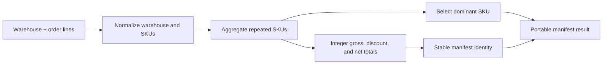

# Regenerative round-trip manifest application

This Component is intentionally rich enough to test specification-to-source and
source-to-specification conversion in both directions. It defines a portable batch
manifest calculator with deterministic normalization, aggregation, ranking, and
identifier behavior. Outside the round-trip test, the same behavior is a credible seed
for warehouse picking, purchase-order consolidation, shipment manifests, and offline
inventory reconciliation.

## Application contract

| Concern | Decision |
| --- | --- |
| Application ID | `regenerative-roundtrip` |
| Kind | `batch-manifest-calculator` |
| Entrypoint | `run` |
| Money | Integer cents (`integer-cents`) |
| Discount | Basis points, rounded down (`basis-points-floor`) |
| Line ordering | SKU ascending by Unicode code point (`sku-codepoint-ascending`) |

### Requirement: Validate a portable manifest request

The application MUST accept one JSON object containing a non-empty `warehouse` string,
a `discount_basis_points` integer from 0 through 10000, and a non-empty `orders` array.
Every order MUST contain a non-empty `sku`, a positive integer `quantity`, and a
non-negative integer `unit_cents`.

#### Scenario: A valid request is accepted

- **GIVEN** a request whose warehouse, discount, and orders meet the declared bounds
- **WHEN** the request is submitted to the `run` entrypoint
- **THEN** the application returns one deterministic JSON result

### Requirement: Normalize and aggregate order lines

The application MUST trim the warehouse and each SKU, combine orders having the same
trimmed SKU, sum their quantities and extended cent values even when their unit prices
differ, and return `lines` sorted by SKU in ascending Unicode code-point order. Each line
MUST contain exactly `sku`, `quantity`, and `subtotal_cents`. The result MUST return the
trimmed warehouse as `warehouse` and the number of distinct aggregated lines as
`line_count`.

#### Scenario: Repeated SKUs are combined

- **GIVEN** several orders including two entries whose trimmed SKU is `A-1`
- **WHEN** the manifest is calculated
- **THEN** the result contains one `A-1` line with summed quantity and subtotal

### Requirement: Calculate discounted integer totals

The application MUST set `gross_cents` to the sum of all line subtotals, set
`discount_cents` to floor(`gross_cents` multiplied by `discount_basis_points` divided by
10000), and set `net_cents` to `gross_cents` minus `discount_cents`. Floating-point
arithmetic MUST NOT affect these integer-cent results.

#### Scenario: A fractional-cent discount is floored

- **GIVEN** a gross total whose basis-point discount is not an integer number of cents
- **WHEN** totals are calculated
- **THEN** `discount_cents` is rounded toward zero and `net_cents` preserves the remainder

### Requirement: Select a deterministic dominant SKU

The application MUST set `dominant_sku` to the SKU with the greatest aggregated
quantity. If multiple SKUs have that quantity, it MUST choose the lexicographically
smallest SKU by Unicode code-point order. The quantity comparison is descending but
the tie-break comparison is ascending; an implementation MUST NOT maximize the tuple
`(quantity, sku)`. For example, equal quantities for `A-1` and `Z-9` select `A-1`.

#### Scenario: Equal quantities use lexical ordering

- **GIVEN** aggregated SKU lines `Z-9` and `A-1` with equal greatest quantities
- **WHEN** the dominant SKU is selected
- **THEN** `A-1` is returned

### Requirement: Derive a stable portable manifest identifier

The application MUST normalize the trimmed warehouse into lowercase ASCII kebab case by
replacing every maximal run of non-ASCII-alphanumeric characters with one hyphen and
removing leading or trailing hyphens. It MUST return `manifest_id` as that normalized
warehouse, a hyphen, the number of distinct aggregated SKU lines, another hyphen, and
`net_cents`.

#### Scenario: Warehouse punctuation is normalized

- **GIVEN** a warehouse named ` North Hub / West `
- **WHEN** the identifier is derived
- **THEN** its prefix is `north-hub-west`

### Requirement: Expose the manifest calculation

The Component MUST expose the complete manifest calculation through its declared `run`
entrypoint. Its result MUST contain exactly `warehouse`, `manifest_id`, `dominant_sku`,
`line_count`, `gross_cents`, `discount_cents`, `net_cents`, and `lines`, with the values
defined by the validation, aggregation, total, ranking, and identifier requirements
above. It MUST NOT echo `discount_basis_points` or the unaggregated input `orders`.

#### Scenario: The compiled entrypoint runs on the host

- **GIVEN** any supported selected language Flavor and host OS Flavor
- **WHEN** the built `run` entrypoint is invoked
- **THEN** its JSON output matches the complete result contract
