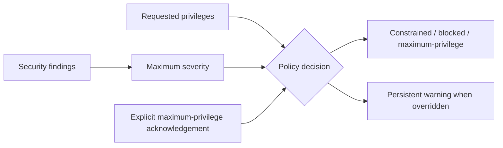

# Deployment Security Gate

The gate reduces findings and requested privileges to one explicit deployment decision.
It is a compact starting point for CI admission, plugin review, infrastructure change
approval, and agent-execution policy where a dangerous override must remain visible
rather than silently turning a blocked result into success.

## Application contract

| Concern | Decision |
| --- | --- |
| Application ID | `security-policies` |
| Kind | `security-policy` |
| Entrypoint | `run` |
| Severity order | Informational, low, medium, high, critical |
| Blocking threshold | Critical |
| Maximum-privilege warning | `YOLO MAXIMUM PRIVILEGE` |

The `run` entrypoint SHALL accept exactly one argument object containing exactly
`findings`, `requested_privileges`, and `yolo_acknowledged`. `findings` SHALL be an array
of objects containing exactly the string fields `id` and `severity`;
`requested_privileges` SHALL be an array of strings; and `yolo_acknowledged` SHALL be a
boolean. The result SHALL contain exactly `decision`, `maximum_severity`,
`requested_privileges`, and `warning`. `warning` SHALL be JSON `null` unless an explicit
maximum-privilege decision requires the literal warning declared above.

### Requirement: Explicit maximum-privilege acknowledgement

Blocked source SHALL remain blocked unless a reviewer explicitly acknowledges maximum
privilege and retains its warning.

#### Scenario: Critical finding

- **WHEN** a critical finding blocks a build and maximum privilege is not acknowledged
- **THEN** authorization fails, while an explicit full-privilege acknowledgement carries the persistent `YOLO MAXIMUM PRIVILEGE` warning

### Requirement: Executable host outcome

The generated policy application SHALL classify the argument object's `findings`
according to the declared severity order, preserve the requested privilege array, and
produce an explicit constrained, blocked, or maximum-privilege decision.

#### Scenario: Compiled entrypoint runs

- **WHEN** the compiled `run` entrypoint receives a critical finding without maximum-privilege acknowledgement
- **THEN** it returns a blocked decision, preserves the requested compiler privilege, and emits no bypass warning
