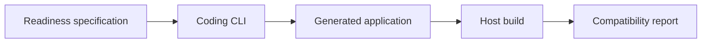

# Literate AI framework compatibility readiness

This sample is intentionally framework-specific rather than a general product building
block. It proves that a generated application can report Literate AI version and skill
readiness without importing the repository checkout. Keep it as a conformance reference;
start from another sample when designing an end-user application.

## Application contract

| Concern | Decision |
| --- | --- |
| Application ID | `self-hosting` |
| Kind | `framework-compatibility-readiness-command` |
| Entrypoint | `run` |
| Operation | `framework-compatibility-readiness` |
| Default expected framework version | `0.2.0` |
| Default required skills | `api-surface`, `architecture`, `behavior-state`, `operations`, `security`, `tests` |

### Requirement: Framework compatibility readiness

The application SHALL evaluate a request against the specification-declared Literate AI
framework compatibility baseline and packaged source-to-specification skill catalog.
The invocation object MAY supply `expected_framework_version` and
`required_skill_ids`; omitted values SHALL use the defaults in the application contract.

The result SHALL report the specification-declared supported framework version, the
operation `framework-compatibility-readiness`, the requested skill identifiers that are
packaged in ascending identifier order, and `public_api_ready`. `public_api_ready` SHALL
be true only when the supported version equals the requested version and every requested
skill is packaged.

The Component-facing execution interface SHALL contain invocation cases and a closed
result shape, but no expected result, oracle path, oracle identity, or snapshot
replication input. Any verifier-only oracle SHALL be separately content-pinned by the
test harness and SHALL bind the exact execution-interface identity.

#### Scenario: Requested capabilities are reported

- **WHEN** the generated `run` entrypoint receives a version and skill-set request
- **THEN** it emits the deterministic compatibility and readiness report as one JSON object

### Requirement: Portable generated application

The readiness application SHALL compile entirely to a runnable host artifact using the
selected language and host Flavors. It SHALL perform the specified compatibility work
without importing the repository checkout or copying framework source.

#### Scenario: Generated host artifact runs

- **WHEN** the selected Python or C++ recipe is generated, validated, authorized, and built
- **THEN** its host artifact evaluates every invocation without source-tree replication

### Requirement: Snapshot replication is separate conformance

Exact framework snapshot replication SHALL NOT be represented as coding-CLI generation
or as behavior of the readiness application. A verifier-only conformance proof MAY
replay an already frozen package snapshot through concrete lifecycle adapters and check
two-generation stability. That deterministic replay is separately pinned in test
harness metadata and SHALL NOT enter the Component specification-to-source recipe.

#### Scenario: Authorities remain separate

- **WHEN** the public generation recipe is inspected
- **THEN** it contains the readiness specification and portable generation skills but no snapshot-replication skill set or proof manifest
