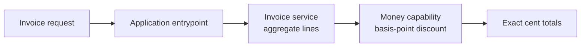

# Composable Invoice Service

This is the clearest Component-composition example in the catalog: an application owns
the executable boundary, an invoice service owns line aggregation, and an exact-money
library owns integer discount arithmetic. The same shape adapts naturally to carts,
quotes, subscriptions, usage billing, and procurement tools.

## Application contract

| Concern | Decision |
| --- | --- |
| Application ID | `service-stack` |
| Kind | `invoice` |
| Entrypoint | `run` |
| Currency storage | Integer cents (`integer-cents`) |
| Discount unit | Basis points (`basis-points`) |
| Rounding | Half up (`half-up`) |

### Requirement: Exact transitive composition

The `component://samples/service-stack` application SHALL require
`literate-ai.invoice-service` from `component://literate-ai/invoice-service`. That Component SHALL
in turn require `literate-ai.money-calculation` from
`component://literate-ai/money-calculation`. Generation SHALL preserve all three independently
specified logical modules or build targets. Each logical dependency SHALL have a
generation edge carrying only the provider's public interface and a runtime edge
carrying its accepted provider artifact.

#### Scenario: Stack resolution

- **WHEN** the application stack is composed
- **THEN** the service and library each occur once with four exact phase-specific edges

### Requirement: Executable host outcome

The generated invoice application SHALL compose an entrypoint, service layer, and exact
integer-money library to price line items without floating-point currency arithmetic.

#### Scenario: Compiled entrypoint runs

- **WHEN** the compiled `run` entrypoint prices five units across two lines with a ten-percent discount
- **THEN** it returns a 4095-cent subtotal, 410-cent discount, and 3685-cent total
