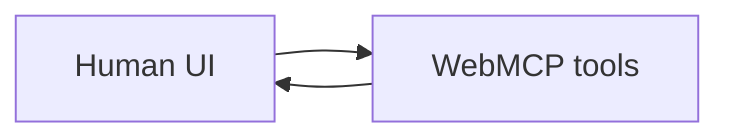

# WebMCP page

In-page MCP tools on a JavaScript front-end. Pins JavaScript explicitly. WebMCP is
MCP in the page, not a backend integration.

## Application contract

| Concern | Decision |
| --- | --- |
| Kind | `web-application` |
| Protocol | WebMCP |
| Language | JavaScript |

### Requirement: Tools update visible page state

The page SHALL register at least one WebMCP tool whose execute path updates visible
state. Invalid input SHALL return a structured error.

#### Scenario: Missing required field is structured

- **WHEN** a browser agent invokes the tool without a required field
- **THEN** the tool returns a structured error and the page remains usable
