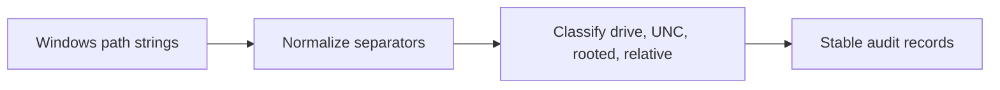

# Windows Path Auditor

This Windows-only Component classifies and normalizes drive, UNC, rooted, and relative
paths before they enter a build or deployment manifest. It is a reusable boundary for
installers, workspace managers, and artifact-copy tools that cannot treat POSIX path
rules as universal.

## Application contract

The `run` entrypoint accepts one object containing exactly `paths`, an array of nonempty
strings. Convert every `/` to `\`, collapse repeated separators except the leading UNC
pair, and preserve drive-letter spelling. Emit one result per input in order, with
exactly `original`, `normalized`, `kind`, and `root`.

Kinds are `drive` for `X:\...`, `unc` for `\\server\share\...`, `rooted` for a single
leading backslash, and `relative` otherwise. A drive root is `X:\`; a UNC root is
`\\server\share`; a rooted path root is `\`; a relative path root is the empty string.

### Requirement: Audit Windows-native paths

The application SHALL classify Windows paths without silently applying POSIX semantics.

#### Scenario: The compiled Windows entrypoint runs

- **WHEN** drive, UNC, rooted, and relative paths are supplied
- **THEN** the application returns their exact normalized forms, kinds, and roots in input order
